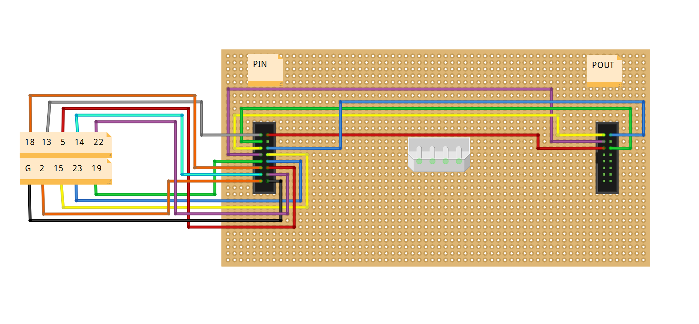

# Tetris ESP32 Clock

http://blough.ie/wifi-tetris-clock/

https://github.com/witnessmenow/WiFi-Tetris-Clock

Installed all the libraries suggested as zip files

Great with text and graphics(limited). So far still playing with it. One or 2 little foibles. Must be in this order:
matrix.setCursor(29,1);
matrix.setTextColor(matrix.Color333(7,0,0));
matrix.print('M');
Otherwise the colour will not be correct: try it!

Thought my panel was dead until found out that the chips used are slightly different to the others in panels that I've tried.

You need FM6126 support in whatever library you use (e.g. PxMatrix), or use rpi-rgb-led-matrix by hzeller and run the reset script beforehand (issue 746 on his github) like I did.